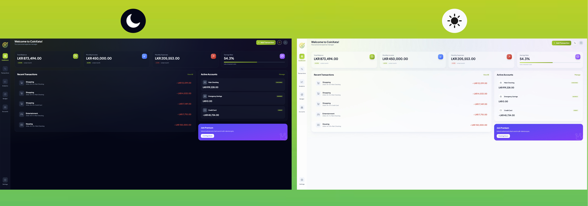
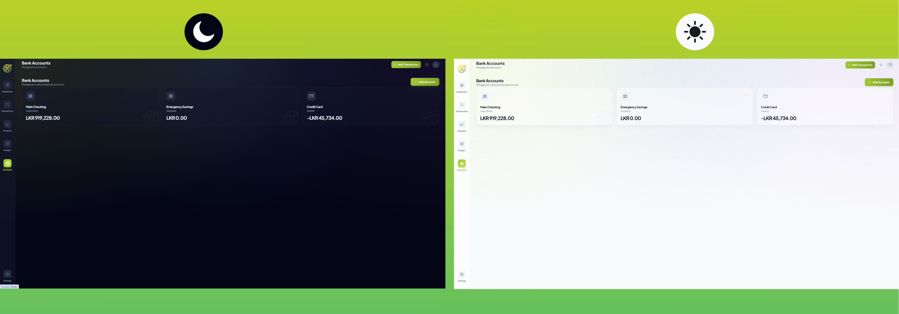
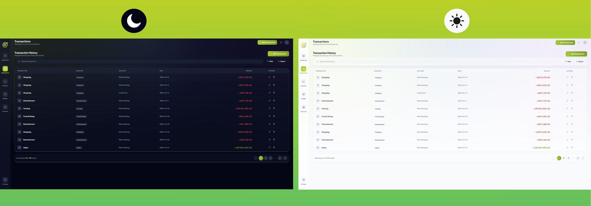
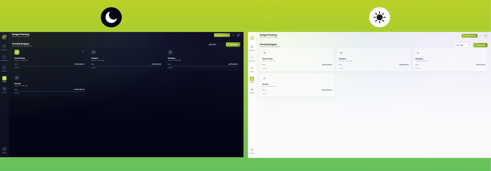
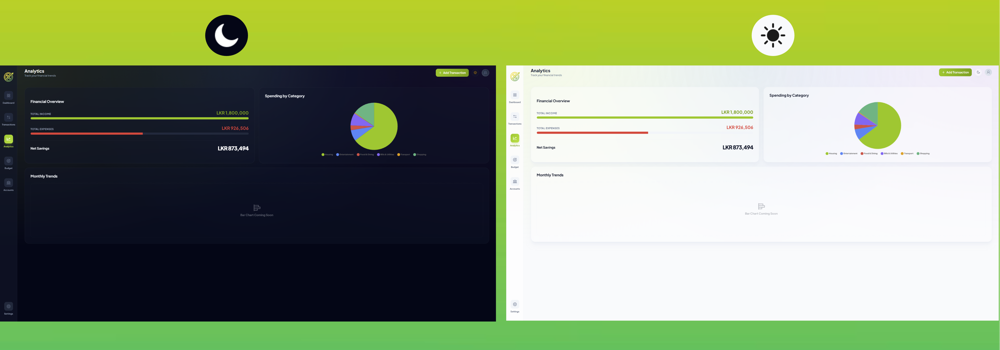
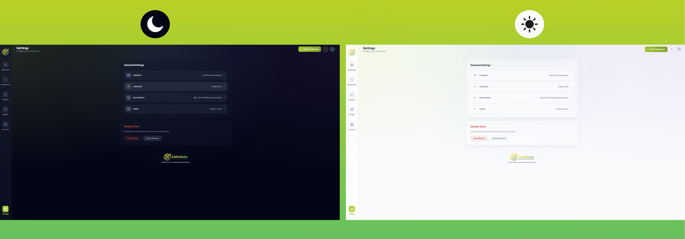

# CoinXata 🪙

A professional, high performance financial management application built with **Laravel**, **Inertia.js**, and **Vue 3**.

---

## ✨ Features

- **Professional Architecture**: Decoupled design using the **Repository Pattern** and dedicated **Service Layer**.
- **Modern UI**: Sleek dark mode interface powered by **Tailwind CSS v4** with glassmorphism and smooth micro-animations.
- **Enterprise Security**: Industry standard **AES-256-GCM** encryption for all sensitive fields (Descriptions, Amounts, Balances).
- **Automation Engine**: Automated generation of recurring transactions and budget targets.
- **Smart Accounting**: Automatic synchronization of account balances across all transactional activities.
- **Financial Analytics**: Comprehensive data visualization using **Chart.js**.

---

## �️ Application Screens

### 📊 Dashboard

The central hub of CoinXata, providing a comprehensive overview of your financial health at a glance.

**Key Features:**
- **Real time Statistics**: Total balance, monthly income/expenses, and savings rate with trend indicators
- **Recent Transactions**: Quick view of latest financial activities with category icons
- **Account Summary**: Active accounts with current balances and account types
- **Premium Promotion**: Eye catching card for future premium features

**Design Elements:**
- Glassmorphism cards with hover effects
- Color coded statistics (green for income, red for expenses, purple for savings)
- Responsive grid layout that adapts to different screen sizes
- Smooth transitions and micro-interactions

---

### 💳 Bank Accounts

Comprehensive account management interface for organizing all your financial accounts.

**Key Features:**
- **Multi Account Support**: Manage checking, savings, credit, cash, and investment accounts
- **Account Cards**: Visual representation with icons and current balances
- **Quick Actions**: Edit and delete accounts with hover revealed controls
- **Empty State**: Intuitive onboarding for new users

**Account Types Supported:**
- Checking Accounts
- Savings Accounts  
- Credit Cards
- Cash Wallets
- Investment Portfolios

**Design Elements:**
- Card-based layout with hover lift effects
- Type specific icons and color coding
- Background icons that rotate on hover
- Floating action button for adding new accounts

---

### 📝 Transaction History

Powerful transaction management with advanced filtering and export capabilities.

**Key Features:**
- **Comprehensive Table**: Detailed view of all transactions with full context
- **Search & Filter**: Find transactions quickly with search bar and filter options
- **Category Icons**: Visual identification using Phosphor icons for each category
- **Bulk Actions**: Edit and delete transactions with confirmation dialogs
- **Pagination**: Efficient handling of large transaction datasets

**Transaction Categories:**
- Food & Dining, Shopping, Transport
- Entertainment, Bills & Utilities
- Income, Salary, Investment
- Other miscellaneous categories

**Design Elements:**
- Clean table design with hover states
- Color-coded amounts (green for income, red for expenses)
- Action buttons that appear on hover
- Responsive table with horizontal scrolling on mobile

---

### 🎯 Monthly Budgets

Intelligent budget planning and tracking to help you achieve your financial goals.

**Key Features:**
- **Monthly Planning**: Set spending limits for different categories
- **Progress Tracking**: Visual progress bars showing budget utilization
- **Recurring Budgets**: Set up automatic monthly budget allocations
- **Month Navigation**: Easy switching between different months
- **Category Management**: Organize budgets by spending categories

**Budget Categories:**
- Housing, Groceries, Food & Dining
- Transport, Shopping, Bills & Utilities
- Health & Fitness, Travel, Entertainment
- Education, Personal Care, Investment, Insurance

**Design Elements:**
- Progress bars with smooth animations
- Category specific icons and colors
- Hover effects revealing delete actions
- Empty state with call-to-action

---

### 📈 Analytics & Reports

Comprehensive financial analytics with interactive charts and insights.

**Key Features:**
- **Financial Overview**: Summary of total income, expenses, and net savings
- **Spending Analysis**: Pie chart showing expense breakdown by category
- **Monthly Trends**: Bar charts for tracking financial patterns over time
- **Visual Progress**: Animated progress bars for income vs expense ratios

**Analytics Features:**
- Real-time calculations based on transaction data
- Interactive charts using Chart.js
- Responsive design that works on all devices
- Color-coded visual indicators

**Design Elements:**
- Split-screen layout for overview and charts
- Smooth animations and transitions
- Professional color scheme
- Mobile-responsive chart sizing

---

### ⚙️ Settings

Application configuration and user preferences management.

**Key Features:**
- **Profile Management**: Update user information and preferences
- **Security Settings**: Manage passwords and authentication
- **Data Management**: Export/import financial data
- **Application Preferences**: Customize app behavior and appearance

---

## �🛠 Tech Stack

- **Backend**: Laravel 12 (PHP)
- **Frontend**: Vue 3 + Inertia.js (Composition API)
- **Styling**: Tailwind CSS v4
- **Database**: MySQL / SQLite
- **Charts**: Chart.js with vue-chartjs
- **Icons**: Phosphor Icons
- **Typography**: Plus Jakarta Sans

---

## 🚀 Getting Started

### Prerequisites
- PHP 8.2+
- Composer
- Node.js & NPM
- MySQL Server

### Installation

1. **Clone the repository**:
   ```bash
   git clone <repository-url>
   cd CoinXata
   ```

2. **Install PHP dependencies**:
   ```bash
   composer install
   ```

3. **Install JS dependencies**:
   ```bash
   npm install
   ```

4. **Configure Environment**:
   ```bash
   cp .env.example .env
   php artisan key:generate
   ```
   *Update your MySQL credentials in `.env`:*
   ```env
   DB_CONNECTION=mysql
   DB_HOST=127.0.0.1
   DB_DATABASE=coinxata
   DB_USERNAME=root
   DB_PASSWORD=
   ```

5. **Run Migrations**:
   ```bash
   php artisan migrate
   ```

6. **Compile Assets**:
   ```bash
   npm run dev
   ```

7. **Start the Server**:
   ```bash
   php artisan serve
   ```

---

## 🤖 Automation

CoinXata includes a built-in automation engine for recurring items.

To process recurring transactions manually:
```bash
php artisan coinxata:process-recurring
```

*Recommended: Add this to your server's crontab for daily processing.*

---

## 🏗 Project Structure

- `app/Repositories`: Interfaces and Eloquent implementations for data access.
- `app/Services`: Core business logic (Encryption, Accounting, Automation).
- `app/Http/Controllers`: Inertia-driven controllers.
- `resources/js/Pages`: Modern Vue pages for all application features.
- `resources/js/Components`: Reusable UI components (Modals, StatCards, Layouts).
- `resources/css/app.css`: Tailwind v4 theme configuration.

---

## 🔒 Security Notice

All sensitive financial data is encrypted at the application level before being stored in the database. Ensure your `APP_KEY` and `ENCRYPTION_KEY` are backed up securely, as data cannot be recovered without them.

---

> Made with ❤️ for Professional Financial Management.
